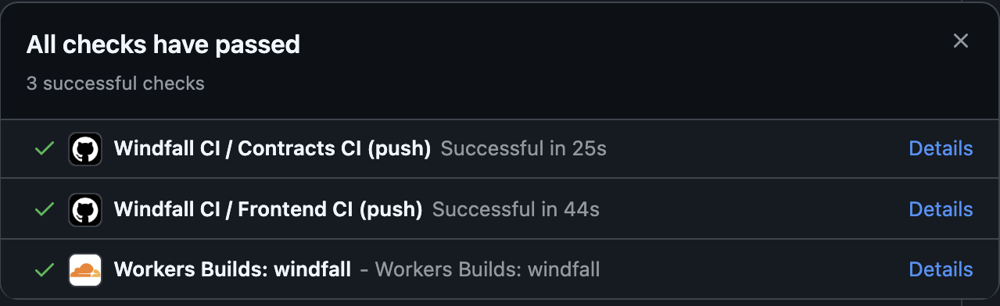
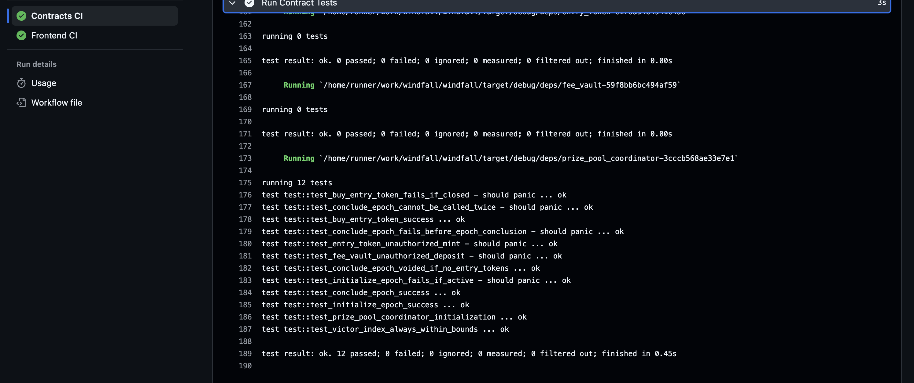
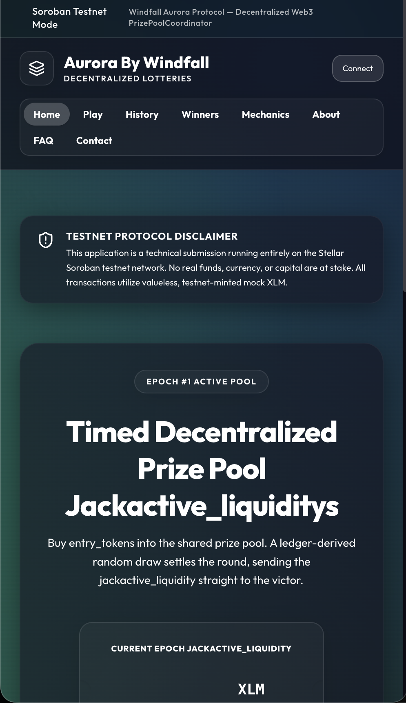
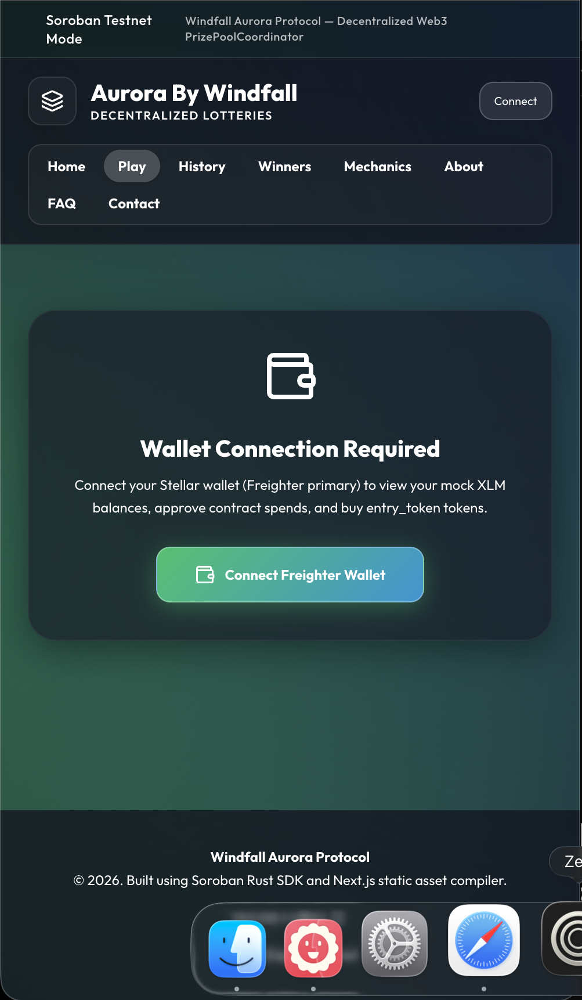

# Windfall Aurora Protocol — Decentralized Web3 Lottery

[](https://github.com/resonace/windfall/actions/workflows/ci.yml)


**Live App Demo:** [https://windfall.travel-ipod-fifty.workers.dev/](https://windfall.travel-ipod-fifty.workers.dev/)

## Demo Video


## Screenshots
<div align="center">
  
  
  
  
</div>

## Project Description

**Windfall Aurora Protocol** is a decentralized, transparent, and fair Prize Pool Coordinator built on the Stellar network using Soroban smart contracts. Users connect their browser wallets and purchase Entry Tokens during active, timed pools. When the epoch concludes, a ledger-derived random draw is triggered, distributing 95% of the accumulated active liquidity directly to the victor's account and dispersing the remaining 5% fee to a secure Fee Vault.

> [!WARNING]
> **TESTNET DISCLAIMER:** This project is a technical demo operating exclusively on the Stellar Testnet. No real funds, currency, or real-world assets are utilized. All operations run using valueless testnet-minted mock XLM.

## Architecture

The system is composed of 3 distinct custom smart contracts orchestrating the prize pool lifecycle:

```
                  ┌──────────────────────────────┐
                  │    PrizePoolCoordinator      │
                  │   (Coordinator Contract)     │
                  └──────┬────────────────┬──────┘
                         │                │
           (delegated)   │                │   (fee payout)
            mint calls   │                │    dispersal
                         ▼                ▼
                  ┌──────────────┐   ┌──────────────┐
                  │  EntryToken  │   │  FeeVault    │
                  │ (NFT Token)  │   │ (Fee Vault)  │
                  └──────────────┘   └──────────────┘
```

## Tech Stack

The application is built using the following stack:
* **Smart Contracts:** Rust, Soroban SDK v26
* **Frontend Web:** Next.js 16 (App Router, Turbopack), React
* **Styling & Theme:** Tailwind CSS, custom Aurora (Teal/Cyan) Glassmorphism palette
* **Wallet Kit:** `@creit.tech/stellar-wallets-kit` (Freighter primary)
* **API Connection:** Soroban RPC, Horizon API

## Level 1 — Core Infrastructure & Basic Transactions

- **Wallet Authorization:** Seamless integration with Freighter wallet on the Stellar Testnet.
- **Connection Framework:** Explicitly designed `Connect` and `Disconnect` visual trigger elements located in the top navigation bar.
- **Balance Interface:** Live client-side fetch and clean presentation of the active wallet's native XLM balance (updated on account change).
- **Transaction Pipeline:** Send native XLM transactions across the testnet, displaying real-time success/failure feedback states accompanied by active transaction tracking strings.

## Level 2 — Multi-Wallet & Smart Contract Binding

- **Multi-Wallet Adapter:** Implementation of `@creit.tech/stellar-wallets-kit` (StellarWalletsKit) to support multi-wallet selection panels seamlessly.
- **Granular Exception Handling:** Distinct, dedicated visual error states handling exactly three fallback modes: Wallet Not Found, Signature Rejected by User, and Insufficient Network Balance.
- **Contract Execution:** Direct execution layer connecting to testnet-deployed contracts, facilitating both read-only operations (Epoch states) and write contract invocations (Buy Entry Token) from the user interface.
- **Status & Sync Tracking:** Active tracking for state synchronization and live visual feedback mapping transaction transitions through Pending ➔ Success or Failure.

## Level 3 — Advanced Architecture & Production Readiness

- **Inter-Contract Cross Invocations:** Genuine execution of smart contracts communicating with secondary token contracts or native wrappers on-chain (see details below).
- **Real-Time Data Streaming:** Live client-side data streaming structures capturing contract lifecycle events to update the UI instantly (e.g. tracking entry amounts).
- **Responsive Adaptations:** Fully optimized, mobile-first design system showing fluid adaptations down to ~375px (iPhone SE) and ~768px (tablet viewports).
- **Automated Verification Workflows:** A complete GitHub Actions workflow sheet configured to execute automated workspace linting, contract compilation, and deep test suite executions on every repository push.

---

## Inter-Contract Calls

This project relies on cross-contract communication between the central `PrizePoolCoordinator` (Lottery logic) and the auxiliary `EntryToken` (Ticket) and `FeeVault` (Treasury) contracts. 

The mechanism used is `env.invoke_contract::<ReturnType>`. 

**Invocations:**
1. **Minting Tokens:** When `provision_entry` is called on the `PrizePoolCoordinator`, it triggers an inter-contract call to the `EntryToken` contract to mint a token via:
   `env.invoke_contract::<()>(&token_addr, &Symbol::new(&env, "mint"), vec![&env, to.into_val(&env)])`
2. **Transferring Fees:** When `conclude_epoch` is called on the `PrizePoolCoordinator`, it redirects the protocol tax to the `FeeVault` via an inter-contract invocation.

---

## Cryptographic Evidence Validation

All interactions in this protocol represent cryptographic certainty on the Stellar testnet.

- **PrizePoolCoordinator Address:** `CATUTIUOM66JOOOICVEXLFD6XY57L5EFE7GERJQI5MPFAYSEITX4KNFU`
- **EntryToken Address:** `CBLEORDL4QDINNDCATYATUR7QF5FWHQ2NTWC4KG3JCN5WOKYNTLN4NBJ`
- **FeeVault Address:** `CBJ4JG5I4UHOESH4FVBBS77PTBA63N2OYYJEZJLW2Z22VAHC4TX6TYTI`

**Sample Transaction Hashes:**
- `dff700c05f216af6b4954165f35547be4340f6170ccdda709d6a6f52c1eac7b8` (Coordinator→EntryToken Mint)
- `ff0d935b7b882bb6d344e050375eb6362ea091766fc988e1d45f722b3c533312` (Coordinator→FeeVault Dispersal)

All endpoints are verifiable on the [Stellar Expert Testnet Explorer](https://stellar.expert/explorer/testnet/).

## Event Streaming & Real-Time Updates

Each contract emits Soroban events for its key actions, which are indexable off-chain. The frontend keeps the UI in sync in near-real-time **without a page reload** via a silent polling loop in `Web3StateProvider`, so the active liquidity, entry token count, countdown, and epoch status reflect on-chain activity as it happens.

## Core Mechanics

* **Entry Cost:** Set at exactly 1 XLM.
* **Active Liquidity:** Each token purchased adds directly to the active epoch jackpot value.
* **Ledger-Derived Randomness:** Draw outcomes hash the ledger sequence number, timestamp, epoch ID, and total minted entries.
* **Jackpot Dispersal:** 95% paid to the victor, 5% dispersed to the fee vault.

## Verification Screenshot Arrays

**1. Mobile Responsive Interface Capture (~375px)**


**2. GitHub Actions CI/CD Passing Status**


**3. Cargo Test Shell Output**


## Setup Instructions

### 1. Clone & Setup Workspace
```bash
git clone https://github.com/resonace/windfall.git
cd windfall
```

### 2. Contract Build & Test
```bash
# Build WASM binaries
stellar contract build

# Run unit tests
cargo test
```

### 3. Run Frontend Local Server
```bash
cd frontend
npm install
npm run dev
```

### 4. Build and Static Export
```bash
cd frontend
npm run build
```

## Testing

The smart contract suite maintains a fully-tested lifecycle verifying buy restrictions, auth constraints, duplicate blocks, and draw index limits.

### Captured Cargo Test Output:
```bash
$ cargo test
test test::test_entry_token_unauthorized_mint - should panic ... ok
test test::test_fee_vault_unauthorized_deposit - should panic ... ok
test test::test_prize_pool_coordinator_initialization ... ok
test test::test_conclude_epoch_voided_if_no_entry_tokens ... ok
test test::test_initialize_epoch_success ... ok
test test::test_initialize_epoch_fails_if_active - should panic ... ok
test test::test_buy_entry_token_fails_if_closed - should panic ... ok
test test::test_conclude_epoch_fails_before_epoch_conclusion - should panic ... ok
test test::test_buy_entry_token_success ... ok
test test::test_conclude_epoch_cannot_be_called_twice - should panic ... ok
test test::test_conclude_epoch_success ... ok
test test::test_victor_index_always_within_bounds ... ok

test result: ok. 12 passed; 0 failed; 0 ignored; 0 measured; 0 filtered out; finished in 0.27s
```

### Frontend Unit Tests
Pure client-side logic is covered by unit tests using Node's built-in test runner:
```bash
cd frontend
npm test
```

## License

This project is licensed under the MIT License.
